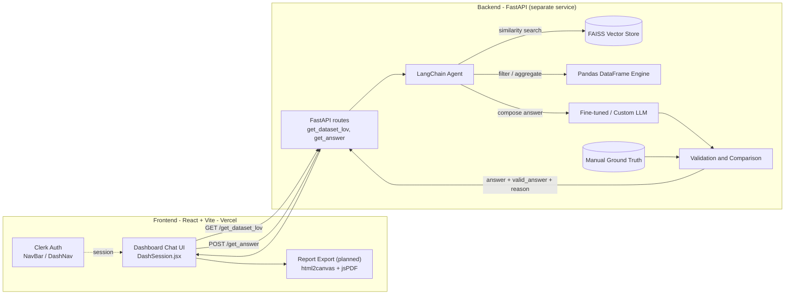
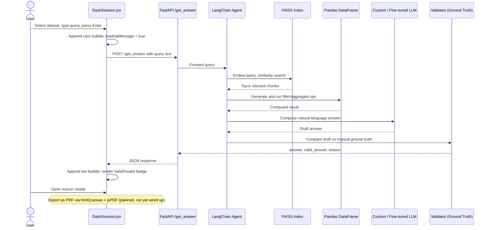

# QueryLensAI

**The only Lens you need for Data Interaction.** ⚡

QueryLensAI is a conversational, AI-powered data-querying platform. A user picks a dataset and asks a question in plain English instead of writing SQL/pandas code; the system routes that question through a fine-tuned model and an LLM agent, computes the answer against the real data, checks it against a curated ground truth, and returns a validated, explainable answer that can ultimately be turned into a shareable report.

🔗 **Live demo:** [querylensai.vercel.app](https://querylensai.vercel.app)

---

## Table of Contents

1. [Overview](#overview)
2. [Repository Scope](#repository-scope)
3. [Feature Matrix](#feature-matrix)
4. [Tech Stack](#tech-stack)
5. [System Architecture](#system-architecture)
6. [Data Journey: From Query to Final Report](#data-journey-from-query-to-final-report)
7. [Frontend Deep Dive](#frontend-deep-dive)
8. [Backend Deep Dive (External Service)](#backend-deep-dive-external-service)
9. [Project Structure](#project-structure)
10. [Getting Started](#getting-started)
11. [Configuration](#configuration)
12. [Available Scripts](#available-scripts)
13. [Deployment](#deployment)
14. [Known Gaps & Tech Debt](#known-gaps--tech-debt)
15. [Roadmap](#roadmap)
16. [Team](#team)
17. [License](#license)
18. [Interview Prep Guide](#interview-prep-guide)

---

## Overview

QueryLensAI aims to remove the "query syntax" barrier between a person and their data. Instead of learning SQL, pandas, or a BI tool's query builder, a user:

1. Signs in and picks one of the datasets the backend has loaded.
2. Types a question in natural language ("What is the average income for states with a population greater than 1 million?").
3. Gets back a natural-language answer that has been **computed** against the real data (not hallucinated) and **validated** against a known-correct reference before being shown.

This document covers the whole system — both what is physically in this repository and what this frontend talks to — so the project can be understood end-to-end.

## Repository Scope

This repository contains **only the frontend**: a React 18 + Vite single-page application. It is the browser client a user interacts with. All natural-language understanding, retrieval, data computation and validation happen in a **separate FastAPI backend service** reached over HTTP (see [`config.js`](config.js)). That backend's source is not part of this codebase; its stack is documented here based on the project's own in-app [Docs page](src/Pages/Docs/Docs.jsx) and the team's [About page](src/Pages/About/About.jsx), cross-checked against the live site, so the full picture is available even though only half of it lives in this repo.

A status tag is used throughout this document:

| Symbol | Meaning |
|---|---|
| ✅ | Verified present in **this repository's** source code |
| 🔗 | Lives in the external FastAPI backend service (separate codebase), reached via REST |
| 🚧 | Part of the product's intended/designed pipeline (per docs/description) but **not yet wired up** in this exact frontend snapshot — see [Known Gaps](#known-gaps--tech-debt) |

## Feature Matrix

| Feature | Status | Where |
|---|---|---|
| Marketing site (Landing, About, Docs) | ✅ | `src/Pages/Home`, `src/Pages/About`, `src/Pages/Docs` |
| Authentication (sign in / sign out / avatar) | ✅ | `@clerk/clerk-react` in `main.jsx`, `NavBar.jsx`, `DashNav.jsx` |
| Live dataset picker | ✅ | `DashSession.jsx` → `GET /get_dataset_lov` |
| Natural-language chat interface | ✅ | `DashSession.jsx` → `POST /get_answer` |
| Per-answer validation badge + reason modal | ✅ | `DashSession.jsx` |
| Natural language → structured query translation (custom/fine-tuned model) | 🔗 | Backend |
| LLM agent orchestration (tool routing) | 🔗 | Backend (LangChain) |
| Retrieval-augmented context (vector similarity search) | 🔗 | Backend (FAISS) |
| Tabular computation over datasets | 🔗 | Backend (pandas) |
| Ground-truth comparison & validation | 🔗 | Backend |
| "Final report" PDF export of a session | 🚧 | Not present in `package.json` or `src/` yet (designed to use `html2canvas` + `jsPDF`) |

## Tech Stack

### Frontend (this repo)

| Layer | Technology | Notes |
|---|---|---|
| UI framework | React 18.3 | 100% functional components + hooks, no class components |
| Build tool / dev server | Vite 6 | `@vitejs/plugin-react` for Fast Refresh over Babel |
| Routing | React Router DOM v7 | Data-driven route map (array → `<Route>`) built in `main.jsx` |
| Auth | Clerk (`@clerk/clerk-react`) | `ClerkProvider`, `SignedIn` / `SignedOut`, `SignInButton`, `UserButton`, `useUser()` |
| Styling | Tailwind CSS 3 + DaisyUI 4 | Utility classes + DaisyUI component classes (`rounded-badge`, `hero`, `carousel`, `mockup-code`) and themes (`light`, `dark`, `cupcake`, `corporate`, `winter`) |
| Rich text styling | `@tailwindcss/typography` | `.prose` classes on the Docs/About long-form content |
| Icons | `lucide-react` | Every icon in NavBar, DashNav, DashMenu, the chat UI and feature cards |
| Animation | `lottie-react` | Plays `database-animation.json` on the dashboard intro screen |
| Linting | ESLint 9 (flat config) | `eslint-plugin-react`, `-hooks`, `-refresh` |
| Installed but **not imported anywhere** in `src/` | `motion`, `react-syntax-highlighter`, `clsx`, `tailwind-merge`, `tailwind-scrollbar` | Present in `package.json`; safe candidates to remove or reasons to wire up (see [Known Gaps](#known-gaps--tech-debt)) |

### Backend 🔗 (separate service — described for completeness)

| Layer | Technology | Purpose |
|---|---|---|
| API framework | **FastAPI** | Exposes `/`, `/get_dataset_lov`, `/get_answer` behind CORS middleware |
| Orchestration | **LangChain** | Agent that decides which tool to invoke (retriever vs. dataframe executor) and assembles the final prompt |
| Vector store | **FAISS** | Similarity search over embedded dataset schema/metadata/docs — the retrieval half of a RAG pipeline |
| Data engine | **pandas** (+ numpy) | Parses the loaded datasets (CSV-style tabular data) and executes the filter/aggregate operations the agent decides on |
| Language model | A fine-tuned / in-house **custom LLM** | Interprets user intent and composes the final natural-language answer from retrieved context + computed results |
| Validation | **Manual ground-truth comparison module** | Compares the generated answer against a curated reference answer, returning a boolean verdict + a plain-English reason |
| Environment | Conda (`environment.yml`), Python 3.11 | As documented on the app's own `/Docs` page |

### Designed but not-yet-present frontend feature 🚧

| Technology | Intended purpose |
|---|---|
| `html2canvas` | Rasterize a DOM node (the chat/validation panel) into a canvas/image, entirely client-side |
| `jsPDF` | Package that rasterized image into a downloadable "final report" PDF |

> Neither package appears in [`package.json`](package.json) nor anywhere under [`src/`](src) in this snapshot — no download/export button or call site currently exists in [`DashSession.jsx`](src/Pages/Dashboard/DashSession.jsx). Treat this section as the target design, not a shipped feature.

## System Architecture



## Data Journey: From Query to Final Report

This is the core of the product — from a user typing a question to a validated, exportable answer.

### Step by step

1. **Dataset discovery** — the instant `DashSession` mounts, a `useEffect` in [DashSession.jsx](src/Pages/Dashboard/DashSession.jsx) calls `GET /get_dataset_lov`. The response's `names[]` array populates the dataset dropdown and the first entry is auto-selected as `selectedVersion`.
2. **Query capture** — the user clicks "New Query" (toggles `isOpen`), types a natural-language question, and presses Enter or the send button. `handleSendMessage()` immediately renders the text as a "user" chat bubble and flips `loadingMessage` to show an animated typing indicator.
3. **Request to the backend** — a `POST /get_answer` request is sent with `{ "query": "<text>" }` as the JSON body.
4. **Custom model interpretation** 🔗 — an in-house fine-tuned model interprets intent, e.g. turning "average income for states with population > 1,000,000" into a filter + aggregate plan (worked example in [Docs.jsx](src/Pages/Docs/Docs.jsx)).
5. **Agentic orchestration** 🔗 — a LangChain agent decides which tools to use: a **FAISS** similarity search retrieves relevant schema/context chunks (retrieval-augmented generation), and a **pandas** execution step filters/aggregates the target dataframe.
6. **Answer composition** 🔗 — the LLM turns the retrieved context + computed result into a natural-language answer.
7. **Ground-truth validation & comparison** 🔗 — the generated answer is checked against a manually curated reference answer for that query, producing a boolean verdict and a plain-English justification.
8. **Response contract** — the backend replies with a single JSON object:
   ```json
   {
     "answer": "The average income for states with a population greater than 1 million is $55,000.",
     "valid_answer": true,
     "reason": "Matches the reference computation within tolerance."
   }
   ```
9. **Rendering the verdict** — the frontend appends `data.answer` as a "bot" bubble (prefixed with a `Brain` icon), derives `"Valid"` / `"Invalid"` from `data.valid_answer`, and renders a green/red badge. Clicking the badge's info icon opens a modal showing `data.reason`.
10. **Final report export** 🚧 — designed to let the user turn the question, answer, verdict and reason into a shareable artifact: `html2canvas` would rasterize the relevant panel of the DOM into an image, and `jsPDF` would embed that image into a downloadable PDF "report". Not implemented in the current frontend snapshot — see [Known Gaps](#known-gaps--tech-debt).

### Sequence diagram



## Frontend Deep Dive

### Routes

Defined as a `RoutesObj` array in [`main.jsx`](src/main.jsx) and mapped into `<Route>` elements:

| Path | Component | Layout | Purpose |
|---|---|---|---|
| `/` | `App` → `Landing` | `MainLayout` | Marketing landing page |
| `/login` | `Login` | `MainLayout` | Placeholder login page (stub, no Clerk sign-in form embedded) |
| `/Docs` | `Docs` | `MainLayout` | Technical documentation page |
| `/About` | `About` | `MainLayout` | Vision, team bios, roadmap, contact links |
| `/Dashboard` | `Dashboard` → `DashScreen` | `DashboardLayout` | Authenticated chat/query workspace |

`Registration.jsx` exists in `src/Pages/Auth/` but is **not imported or routed anywhere** — it's an orphaned page today.

### Layout system

Two composable layouts wrap page content via a `children` prop:

- [`MainLayout.jsx`](src/Layout/MainLayout.jsx) — `NavBar` + page content + `FooterSec`, used by every public/marketing page.
- [`DashboardLayout.jsx`](src/Layout/DashboardLayout.jsx) — a sticky `DashNav` + page content (no footer built in; `Dashboard.jsx` appends its own copyright line below the layout).

### File-by-file reference

**Components**

| File | Responsibility |
|---|---|
| [`NavBar.jsx`](src/Components/NavBar.jsx) | Responsive top nav for marketing pages: hamburger dropdown on mobile, nav links, Clerk `SignInButton`/`UserButton` |
| [`DashNav.jsx`](src/Components/DashNav.jsx) | Dashboard top bar: logo, Clerk user avatar (`useUser()`), and a "Logout" link that routes to `/` |
| [`DashMenu.jsx`](src/Components/DashMenu.jsx) | Collapsible sidebar (Query List / Need Help / Settings) inside the chat workspace — items are static placeholders today |
| [`Cards.jsx`](src/Components/Cards.jsx) | Vertical DaisyUI carousel of three `FeatureCard`s, shown on the Landing page |
| [`FeatureCard.jsx`](src/Components/FeatureCard.jsx) | Reusable image + headline + details card with a "Read More" CTA |
| [`AboutCard.jsx`](src/Components/AboutCard.jsx) | Background-image CTA banner ("Wanna Know More?") at the bottom of the About page |
| [`FooterSec.jsx`](src/Components/FooterSec.jsx) | Global footer with quick links, rendered by `MainLayout` |
| [`Animations/DatabaseAnimation.jsx`](src/Components/Animations/DatabaseAnimation.jsx) | Wraps `lottie-react` to play `database-animation.json` |
| [`Custom/CustomScroll.css`](src/Components/Custom/CustomScroll.css) | Scoped `.custom-scrollbar` styling for the chat message list |

**Pages**

| File | Responsibility |
|---|---|
| [`Home/Landing.jsx`](src/Pages/Home/Landing.jsx) | Hero section, "Try Demo" CTA → `/Dashboard`, "How it Works" image strip, feature carousel |
| [`About/About.jsx`](src/Pages/About/About.jsx) | Vision statement, 3 team bios, origin story, future goals, contact links |
| [`Docs/Docs.jsx`](src/Pages/Docs/Docs.jsx) | Documents backend environment setup, API endpoints and example query transformations |
| [`Auth/Login.jsx`](src/Pages/Auth/Login.jsx) | Stub page (`<div>Login</div>`) |
| [`Auth/Registration.jsx`](src/Pages/Auth/Registration.jsx) | Stub page, not wired into routing |
| [`Dashboard/Dashboard.jsx`](src/Pages/Dashboard/Dashboard.jsx) | Thin wrapper: `DashboardLayout` + `DashScreen` + a copyright line |
| [`Dashboard/DashScreen.jsx`](src/Pages/Dashboard/DashScreen.jsx) | Dashboard "home": greets the signed-in user, shows the Lottie animation, toggles between the intro panel and `DashSession` |
| [`Dashboard/DashSession.jsx`](src/Pages/Dashboard/DashSession.jsx) | **The core product experience** — dataset dropdown, chat thread, validation badge + reason modal, message input |

### State management

There is no global store (no Redux/Zustand/Context) — every piece of state is local `useState` inside the component that needs it:

- `DashSession.jsx` owns the most state: `messages`, `inputText`, `selectedVersion`, `datasetVersions`, `loadingDatasets`, `loadingMessage`, `validationResult`, `validationReason`, `isModalOpen`, `dbDropdownOpen`, `isOpen`, `chat`.
- Data fetching is done with the native `fetch()` API directly inside `useEffect`/event handlers — no React Query/SWR/Axios layer.

### Authentication flow (Clerk)

1. `main.jsx` wraps the entire `<Routes>` tree in `<ClerkProvider publishableKey={...} afterSignOutUrl="/">`.
2. `NavBar.jsx` renders `<SignedOut><SignInButton/></SignedOut>` / `<SignedIn><UserButton/></SignedIn>` to switch between a sign-in prompt and the account menu.
3. `DashNav.jsx` and `DashScreen.jsx` call `useUser()` to read `user.firstName` / `user.imageUrl` and personalize the dashboard greeting and avatar.
4. The publishable key (`pk_test_...`) is hardcoded as a constant in `main.jsx`. This is safe to expose (publishable keys are meant for the client), but not ideal for multi-environment config — see [Known Gaps](#known-gaps--tech-debt).

### Styling system

- **Tailwind CSS** utility classes throughout, configured in [`tailwind.config.js`](tailwind.config.js) with content globs over `index.html` and `src/**/*.{js,jsx}`.
- **DaisyUI** supplies higher-level component classes (`rounded-badge`, `hero`, `carousel`, `mockup-code`) and a theme list (`light`, `dark`, `cupcake`, `corporate`, `winter`); `index.html` pins `data-theme="winter"`.
- **`@tailwindcss/typography`** provides the `.prose` class used for the long-form Docs/About content.
- A hand-written custom scrollbar (green thumb) is defined **twice** — once in [`index.css`](src/index.css) and again in [`CustomScroll.css`](src/Components/Custom/CustomScroll.css) — only the latter is actually imported (by `DashSession.jsx`).

### API integration layer

[`config.js`](config.js) is the single source of truth for backend URLs:

```js
const API_BASE_URL = 'http://localhost:8000'
const API_ENDPOINTS = {
    GET_DATASET: `${API_BASE_URL}/get_dataset_lov`,
    GET_ANS_V0: `${API_BASE_URL}/get_answer`,
}
```

A commented-out fallback (`http://52.224.54.204:8002`) and commented-out `GET_ANS_V1`/`GET_ANS_V2` entries show the team has already run the backend from a hosted VM and is anticipating versioned answer endpoints, even though only `v0` is wired up today.

## Backend Deep Dive (External Service)

🔗 This section documents the backend **as described by the project itself** (in-app Docs page, About page, and the live site) — its source is not part of this repository.

### Endpoints

| Method & Path | Purpose | Response shape |
|---|---|---|
| `GET /` | Health check | `{ "Hello": "Welcome to QueryLensAI" }` |
| `GET /get_dataset_lov` | List available datasets | `{ "names": ["acs_data", "sales_records", ...] }` |
| `POST /get_answer` | Answer a natural-language query | `{ "answer": string, "valid_answer": boolean, "reason": string }` |

### Conceptual pipeline

1. **FastAPI** receives the request and applies CORS middleware so the Vercel-hosted frontend (a different origin) is allowed to call it.
2. **LangChain** builds/drives an **agent** that chooses between retrieval and computation tools for the given query rather than calling the LLM blind.
3. **FAISS** stores vector embeddings of dataset schema/metadata/documentation; the agent runs a similarity search to pull the most relevant context chunks — the retrieval half of a retrieval-augmented-generation (RAG) pattern.
4. **pandas** (with numpy) parses the actual dataset and executes the filter/aggregate/group operations the agent determines are needed — this is what makes answers computed rather than guessed.
5. A **fine-tuned/custom LLM** composes the final natural-language answer from the retrieved context and the computed result.
6. A **validation module** compares that answer against a **manually curated ground truth** for the query and returns `valid_answer` (boolean) plus a human-readable `reason` — effectively a built-in, self-auditing accuracy check on every response.
7. The environment is managed with **Conda** (`environment.yml`) on **Python 3.11**, per the in-app Docs page.

## Project Structure

```text
QueryLens_AI-master/
├── config.js                 # Backend base URL + API endpoint map
├── eslint.config.js          # Flat ESLint config (React + Hooks + Refresh)
├── index.html                # Vite entry HTML, pins DaisyUI theme "winter"
├── package.json               # Dependencies & npm scripts
├── postcss.config.js         # Tailwind + Autoprefixer
├── tailwind.config.js        # Tailwind content globs, typography + daisyui plugins
├── vite.config.js            # Vite + @vitejs/plugin-react
├── public/                   # Static assets (logo, marketing images, favicon)
└── src/
    ├── main.jsx               # App entry: BrowserRouter > ClerkProvider > Routes
    ├── App.jsx                # Root route element (renders Landing in MainLayout)
    ├── index.css              # Tailwind directives + a scrollbar style
    ├── Components/            # Reusable UI building blocks (see table above)
    │   ├── Animations/        # Lottie wrapper + animation JSON
    │   └── Custom/             # Scoped custom-scrollbar CSS
    ├── Layout/                 # MainLayout & DashboardLayout composition wrappers
    └── Pages/
        ├── Home/               # Landing page
        ├── About/              # Team & vision page
        ├── Docs/                # In-app technical documentation
        ├── Auth/                # Login (stub) & Registration (stub, unrouted)
        └── Dashboard/           # Dashboard, DashScreen, DashSession (core product)
```

## Getting Started

### Prerequisites

- Node.js 18+ and npm
- A running instance of the QueryLensAI backend reachable at the URL configured in [`config.js`](config.js) (defaults to `http://localhost:8000`)

### Install & run

```bash
git clone <this-repo-url>
cd QueryLens_AI-master
npm install
npm run dev
```

The dev server starts on Vite's default port (`http://localhost:5173`) with hot module reload.

## Configuration

| What | Where | Notes |
|---|---|---|
| Backend base URL | [`config.js`](config.js) → `API_BASE_URL` | Currently a hardcoded constant; swap the commented line to point at a different environment |
| Clerk publishable key | [`main.jsx`](src/main.jsx) → `PUBLISHABLE_KEY` | Hardcoded inline; safe to expose (publishable, not secret) but not environment-aware |
| Tailwind theme | [`index.html`](index.html) → `data-theme="winter"` | One of the themes listed in `tailwind.config.js`'s `daisyui.themes` |

For real multi-environment use, both the API URL and the Clerk key would be better sourced from Vite's `import.meta.env.VITE_*` variables backed by `.env.development` / `.env.production` files.

## Available Scripts

| Command | Effect |
|---|---|
| `npm run dev` | Start the Vite dev server with HMR |
| `npm run build` | Production build to `dist/` |
| `npm run preview` | Serve the production build locally |
| `npm run lint` | Run ESLint across the project |

## Deployment

- **Frontend**: deployed on **Vercel** at [querylensai.vercel.app](https://querylensai.vercel.app). Vite apps deploy to Vercel with effectively zero config (build command `npm run build`, output directory `dist`).
- **Backend** 🔗: not deployed from this repo. `config.js` contains a commented fallback (`http://52.224.54.204:8002`), indicating the FastAPI service has also been run from a self-hosted VM in addition to local development.

## Known Gaps & Tech Debt

These were found by reading through the current source in detail — useful both as an honest snapshot of the codebase and as material for a code-review discussion:

1. **Selected dataset is never sent to the backend.** `handleSendMessage` in [`DashSession.jsx`](src/Pages/Dashboard/DashSession.jsx) guards on `selectedVersion` being set, but the `POST /get_answer` body only contains `{ query }` — the chosen dataset name isn't included in the request.
2. **The chat workspace is effectively unreachable today.** [`DashScreen.jsx`](src/Pages/Dashboard/DashScreen.jsx) only renders `DashSession` when its local `open` state is `true`, but `setOpen` is never called anywhere in the file — the "Get Started" button is a plain `<a href="https://http://localhost:3000/">` (note the malformed, doubled protocol) instead of an `onClick` handler that flips `open`.
3. **`Registration.jsx` is orphaned** — it exists but isn't imported or routed in `main.jsx`; `Login.jsx` is a bare placeholder with no real Clerk sign-in form embedded.
4. **Mixed router imports** — [`Landing.jsx`](src/Pages/Home/Landing.jsx) imports `Link` from `'react-router'` while every other file imports it from `'react-router-dom'`. It resolves today because `react-router-dom@7` depends on `react-router` internally, but it's inconsistent.
5. **No environment-variable configuration** — both the Clerk publishable key and the backend base URL are hardcoded constants rather than `.env`-driven values.
6. **Installed-but-unused dependencies** — `motion`, `react-syntax-highlighter`, `clsx`, `tailwind-merge`, and `tailwind-scrollbar` are in `package.json` with no matching import anywhere under `src/`.
7. **Duplicate CSS** — `.custom-scrollbar` rules exist in both `index.css` and `Components/Custom/CustomScroll.css` with slightly different colors; only the latter is actually imported.
8. **Invalid HTML nesting** — [`App.jsx`](src/App.jsx) renders `<h1><Landing /></h1>`; `Landing`'s root element is a `<div>`, which is not valid inside an `<h1>`.
9. **"Final report" PDF export isn't implemented** — `html2canvas`/`jsPDF` aren't in `package.json` and there's no export/download call site in the current code, despite being part of the intended pipeline.
10. **Several interactive elements have no handlers yet** — `FeatureCard`'s "Read More", `DashMenu`'s sidebar items, and `AboutCard`'s "Let's Connect" all render without an `onClick`.

## Roadmap

Per the team's own "Our Future Goals" section on the About page:

- Real-time analysis through live database connections (beyond static/CSV datasets)
- Integrating machine learning for predictive insights (not just descriptive answers)
- Fine-tuning the platform for specialized industries: healthcare, finance, retail

## Team

| Name | Role | Focus |
|---|---|---|
| Subhadeep Chell | Full-Stack Developer & UI/UX Product Designer | Frontend architecture, product design |
| Sayan Deb | iOS & Full-Stack Developer | Backend/API design, LLM + metadata-driven query processing |
| Sandhit Karmakar | Android & Web Developer | Cross-platform reach, web functionality |

## License

No `LICENSE` file is present in this repository at the time of writing.


